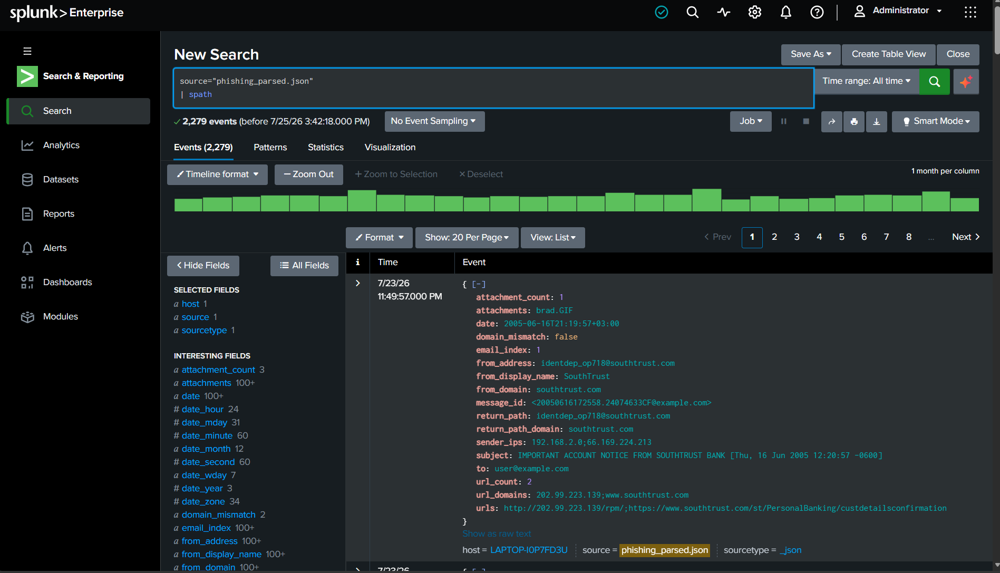
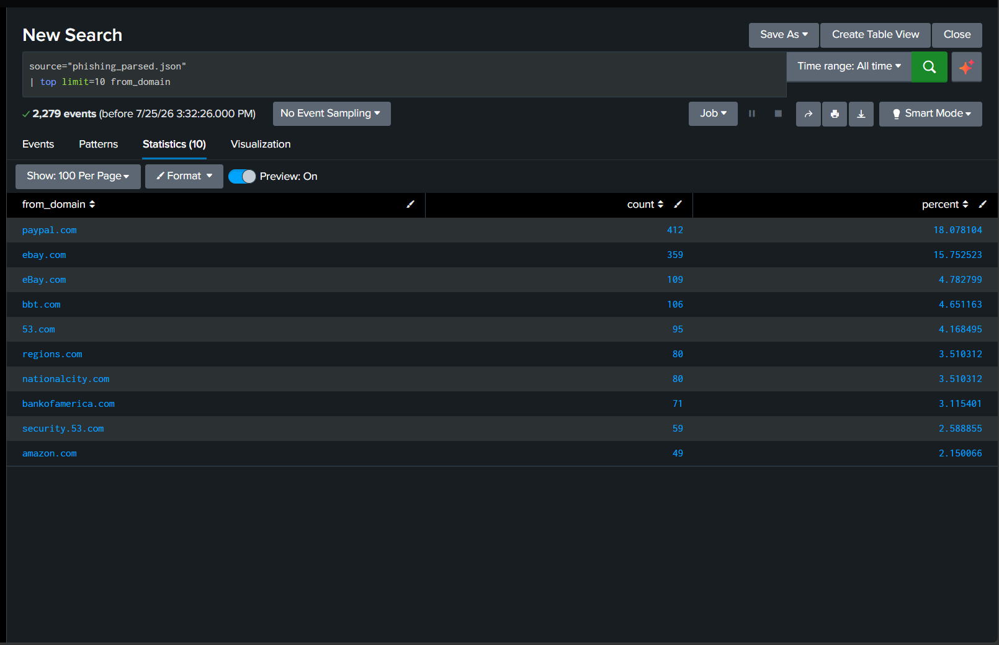
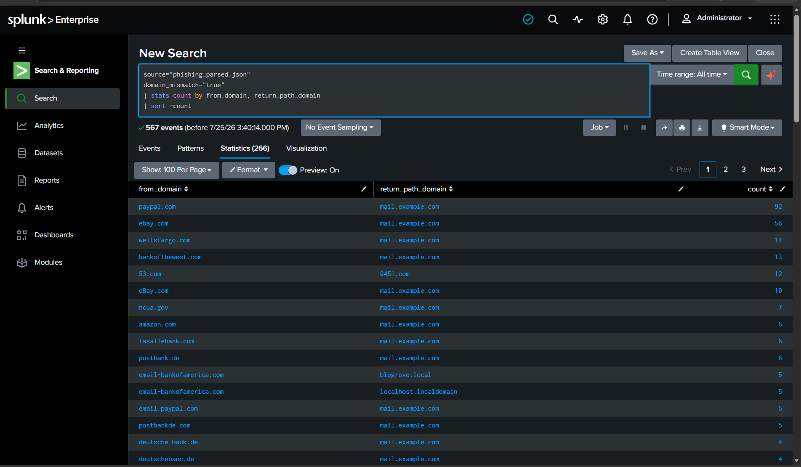
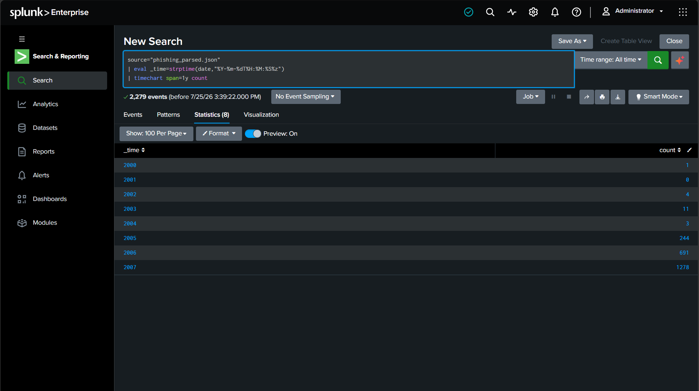
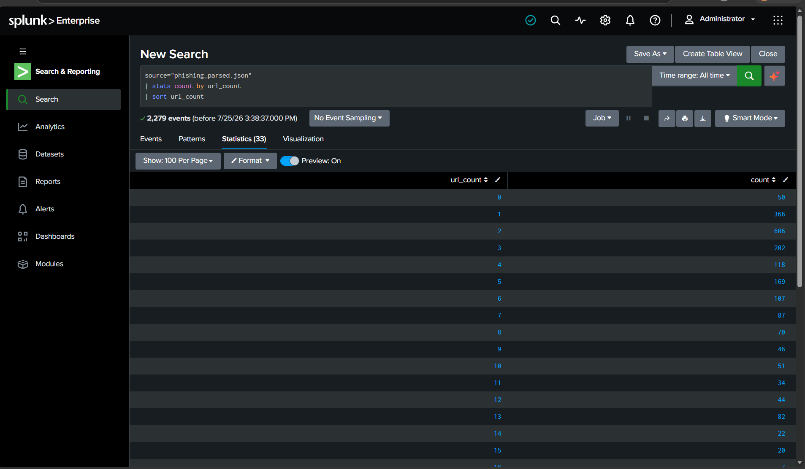
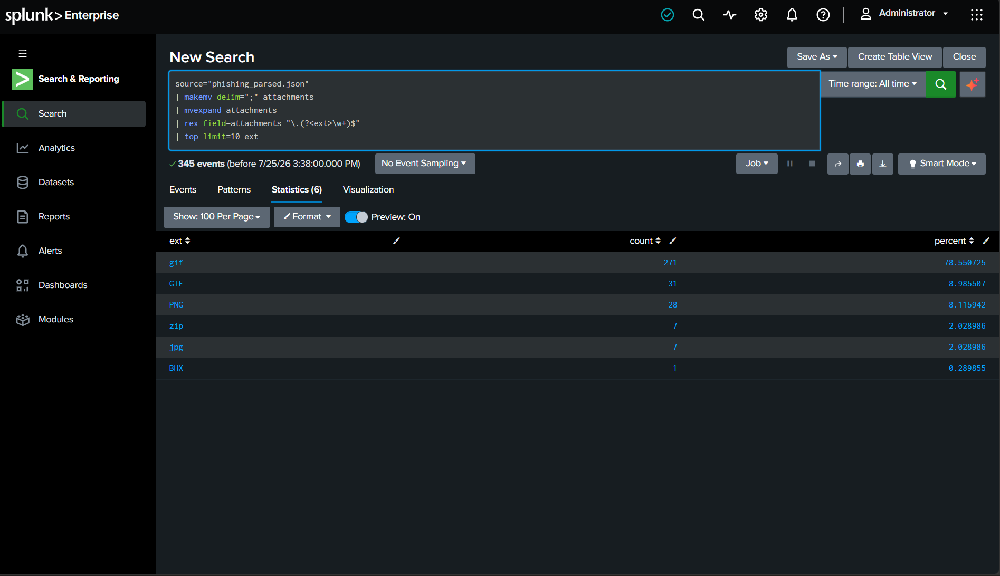
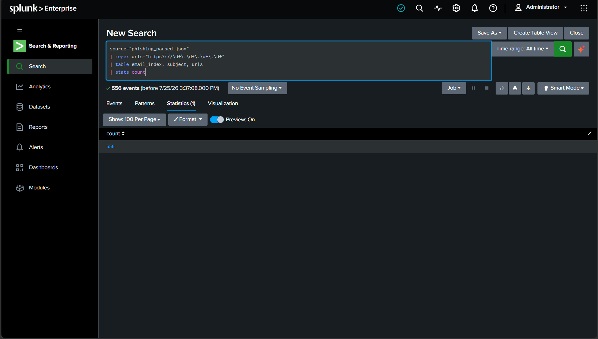
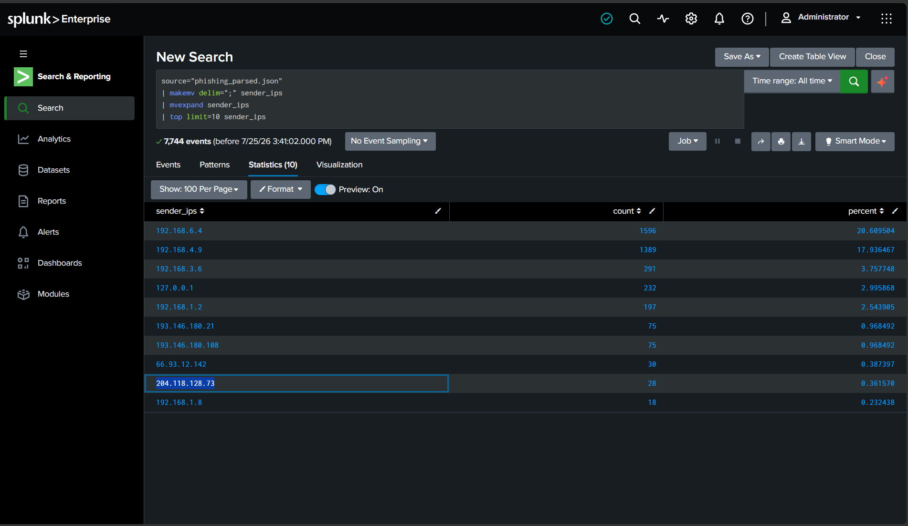

# Phishing Email Dataset Analysis — Splunk

## Overview
This project analyzes a dataset of **2,279 phishing emails** (`dataset/phishing_parsed.json`) using **Splunk Enterprise (SPL)** to identify sender spoofing patterns, malicious URL infrastructure, attachment-based threats, and phishing volume trends over time.

**Dataset fields:** `email_index`, `date`, `from_display_name`, `from_address`, `from_domain`, `return_path`, `return_path_domain`, `domain_mismatch`, `to`, `subject`, `message_id`, `sender_ips`, `url_count`, `urls`, `url_domains`, `attachment_count`, `attachments`

---

## 1. Data Ingestion & Field Extraction
Ingested the JSON dataset into Splunk with `_json` sourcetype and validated field extraction using `spath`.

```spl
source="phishing_parsed.json"
| spath
```

**Result:** 2,279 events successfully parsed with all 17 fields auto-extracted.



---

## 2. Top Spoofed Brand Domains
Identified which legitimate brands were most frequently impersonated in the `from_domain` field.

```spl
source="phishing_parsed.json"
| top limit=10 from_domain
```

**Key finding:** PayPal (412 emails, 18.1%) and eBay (359 + 109 emails, ~20.5% combined) were the most impersonated brands, followed by regional banks (BB&T, 53.com, Regions, National City, Bank of America).



---

## 3. Domain Mismatch Analysis (Spoofing Detector)
Cross-referenced `from_domain` against `return_path_domain` for emails flagged with `domain_mismatch=true` — a strong phishing indicator since legitimate senders rarely mismatch these headers.

```spl
source="phishing_parsed.json" domain_mismatch="true"
| stats count by from_domain, return_path_domain
| sort -count
```

**Result:** 567 of 2,279 emails (24.9%) show a from/return-path domain mismatch. PayPal spoofs (92 events) and eBay spoofs (56 events) top the list, almost all routing replies back to `mail.example.com`.



---

## 4. Sender IP Infrastructure Analysis
Expanded the multi-value `sender_ips` field to identify the network infrastructure used to relay phishing emails.

```spl
source="phishing_parsed.json"
| makemv delim=";" sender_ips
| mvexpand sender_ips
| top limit=10 sender_ips
```

**Result:** 7,744 total IP hops extracted. Traffic is dominated by internal relay IPs (192.168.6.4 — 20.6%, 192.168.4.9 — 17.9%), with a smaller set of external/public IPs (193.146.180.21, 66.93.12.142, 204.118.128.73) indicating the actual originating mail servers.



---

## 5. URL Count Distribution
Analyzed how many links each phishing email contained, since link-heavy emails often indicate credential-harvesting kits with multiple tracking/redirect URLs.

```spl
source="phishing_parsed.json"
| stats count by url_count
| sort url_count
```

**Result:** Most phishing emails contain 1–2 URLs (366 + 606 = 972 emails, ~43%), typical of simple "click here to verify" lures. A long tail exists up to 30+ URLs, suggesting more sophisticated multi-link kits.



---

## 6. Attachment File-Type Breakdown
Examined attachment extensions to assess whether phishing emails rely on image-based social engineering (fake logos/security badges) vs. executable/archive payloads.

```spl
source="phishing_parsed.json"
| makemv delim=";" attachments
| mvexpand attachments
| rex field=attachments "\.(?<ext>\w+)$"
| top limit=10 ext
```

**Result:** 345 attachments found — overwhelmingly image files (`.gif`/`.GIF` = 302, `.png` = 28, `.jpg` = 7) used to spoof bank/security logos, plus a handful of `.zip` archives (7) that warrant closer inspection as potential payload droppers.



---

## 7. Raw-IP URL Detection (High-Confidence Red Flag)
Flagged phishing URLs that point directly to a raw IP address instead of a domain name — a classic evasion technique to bypass domain reputation/blacklist checks.

```spl
source="phishing_parsed.json"
| regex urls="https?://\d+\.\d+\.\d+\.\d+"
| table email_index, subject, urls
| stats count
```

**Result:** 556 emails (24.4% of the dataset) contain at least one raw-IP link — a significant share, confirming this is a common phishing evasion pattern in the dataset.



---

## 8. Yearly Phishing Volume Trend
Converted the `date` field to Splunk's internal `_time` and charted phishing volume by year to observe growth trends.

```spl
source="phishing_parsed.json"
| eval _time=strptime(date,"%Y-%m-%dT%H:%M:%S%z")
| timechart span=1y count
```

**Result:** Phishing volume in this dataset grows sharply year over year — from a handful of emails in 2000–2004, to 244 in 2005, 691 in 2006, and 1,278 in 2007 — reflecting the real-world explosion of phishing campaigns during that period.



---

## Summary of Key Findings

| Metric | Value |
|---|---|
| Total emails analyzed | 2,279 |
| Domain mismatch (spoofed sender) | 567 (24.9%) |
| Emails with raw-IP links | 556 (24.4%) |
| Most impersonated brand | PayPal (412 emails) |
| Most common attachment type | GIF images (302) |
| Peak phishing year | 2007 (1,278 emails) |

## Tools Used
- **Splunk Enterprise** — SPL search, `spath`, `makemv`/`mvexpand`, `regex`, `rex`, `timechart`
- **Python 3** (stdlib `json`/`collections`) — initial data profiling

## Repo Structure
```
.
├── README.md
├── dataset/
│   └── phishing_parsed.json
└── screenshots/
    ├── 01_raw_event_spath_extraction.png
    ├── 02_top_spoofed_brand_domains.png
    ├── 03_domain_mismatch_by_brand.png
    ├── 04_sender_ip_analysis.png
    ├── 05_url_count_distribution.png
    ├── 06_attachment_filetype_breakdown.png
    ├── 07_raw_ip_url_detection.png
    └── 08_yearly_phishing_trend.png
```
